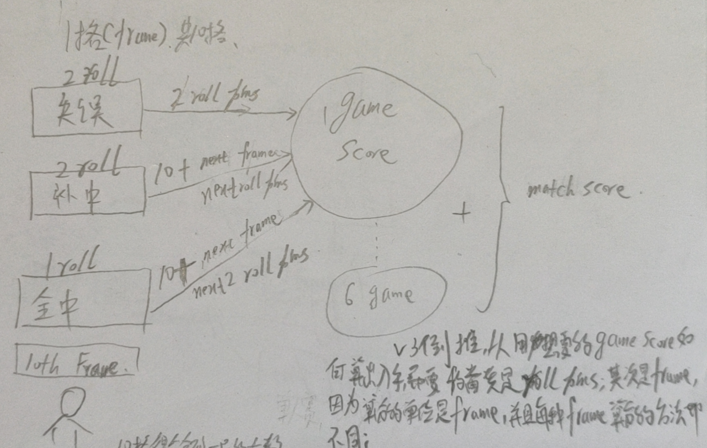
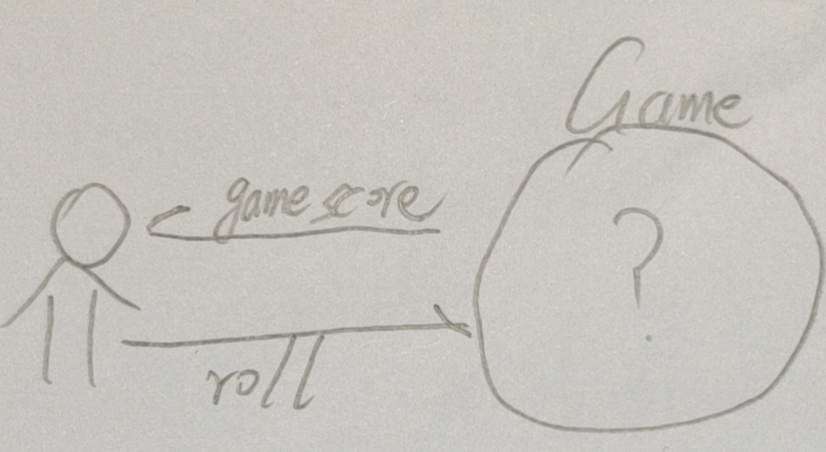
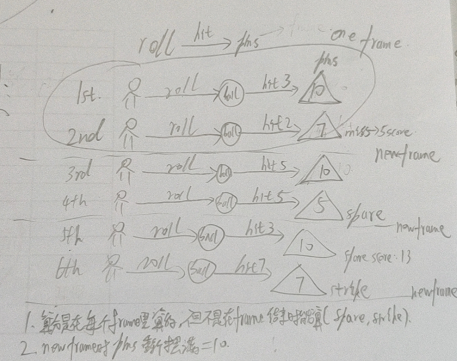
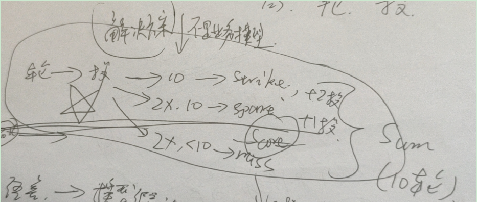

# V1
业务系统建模如下

- 可以看出，模型假设下一投是在frame里
- 所以天然的就会问roll在game里还是在frame里？
    - 第一版选择roll在frame里
- 假设Frame在一开始就全部有了
-   因为没有正确的建模，或者根本上说是一开始就给系统强加了太多的假设
    - 所以实现起来很复杂，别扭，不但要维护frame和nextframe的关系，还要特意处理第10轮
    
# V2
业务系统模型同V1
- 因为发现V1版的实现很复杂，所以决定将roll放到game里
- 将算分放到了frame里
- 需要引入Roll对象才能成功计分

# V3
发现了第1,2版的业务系统模型是有问题的，下一投不一定是next frame的，下一投就是下一投
- 这一版假设frame不是一开始就全部都有了，是通过roll的行为驱动出来的
    - 如果投了miss，就是创建一个missFrame，其他还有spareFrame和strikeFrame
- 所以这一版假设frame就是一个计分单元，需要在计分的时候传入rolls集合才能拿到下一投

# 动态建模版
推翻了之前所有版本的驱动方式
动态建模强调互动，识别系统最有影响力的高频最小互动
系统是通过一个个高频最小互动慢慢长出来的，而不是一开始就做一版业务系统建模或者是技术系统建模，在一开始强加给系统很多的假设
## 互动模型

- 可以看到，互动就两个：score和roll
    -  高频的最小互动是roll
    -   但是score是最有影响力的互动
        - 考虑到score是通过每一投的不同结果算出来的，对score的计算有很大的影响
        - 所以最小互动要重点关注roll的建模
## roll的业务建模

- roll->击球，击倒的pins要用于局分的计算
- roll->new frame，每一轮的开始都是摆满10个pins
- roll->不同的计分规则，miss，spare，strike
## score 业务系统建模(是对规则的理解，还是要做一下)

## note
接下来不要再继续画系统模型了，要用最小互动驱动的方式，逐渐让模型显现出来(演进式架构，浮现式设计)

