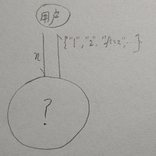

# 指导原则
**响应变化**的外部互动周期：感知-整合-决策-行动
**适应变化**的内部互动周期：评估-改变

## 第一个周期：环境感应
通过对开发环境的探测结果：
- 环境ok，进入下一个周期
- 环境有问题，进行修复调整

## 题目
### 描述

给你一个整数n. 从 1 到 n 按照下面的规则打印每个数：

如果这个数被3整除，打印fizz.

如果这个数被5整除，打印buzz.

如果这个数能同时被3和5整除，打印fizz buzz.

### 样例

比如 n = 15, 返回一个字符串数组：

[

"1", "2", "fizz",

"4", "buzz", "fizz",

"7", "8", "fizz",

"buzz", "11", "fizz",

"13", "14", "fizz buzz"

]

## 非动态敏捷--设计，编排，拆分，都是从系统的内部视角在看问题
- 我们要做一个设计，比如
    - 内部的数据结构是数组，因为从样例看是个集合
    - 算法和除3除5有关
    - 用户会输入一个n，输入可能会有各种场景问题
    - 还要有输出，给用户想要的结果
- 如何编排case，怎么拆分系统？
    - 既然是拆分，那么肯定有一个整体，问题来了，现在系统还没有形状，何谈拆分？对一个不存在的东西怎么拆分？
    - 编排case就更难了，从哪里下手？算法？用户输入？输出？还是都可以？
    - 如果是uncle Bob，他会怎么编排？    

## 动态敏捷--破题，从外部互动的动态系统视角看问题，互动，涌现，整体

## 第一个周期：有一个系统和用户互动