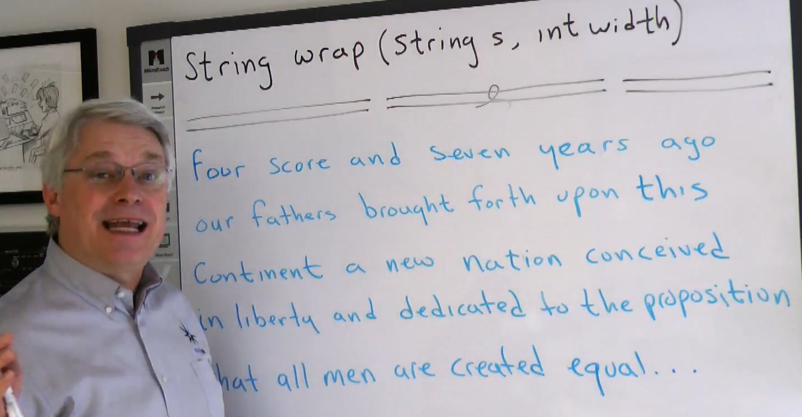

# word-wrap problem

- 

bob大叔用这个算法问题类的kata演示get stuck和get unstuck。
需求描述：
- input string is a sequence of words separated by single spaces.
- no punctuation, no multiple spaces.
- output string will be input string except that no line longer than width.